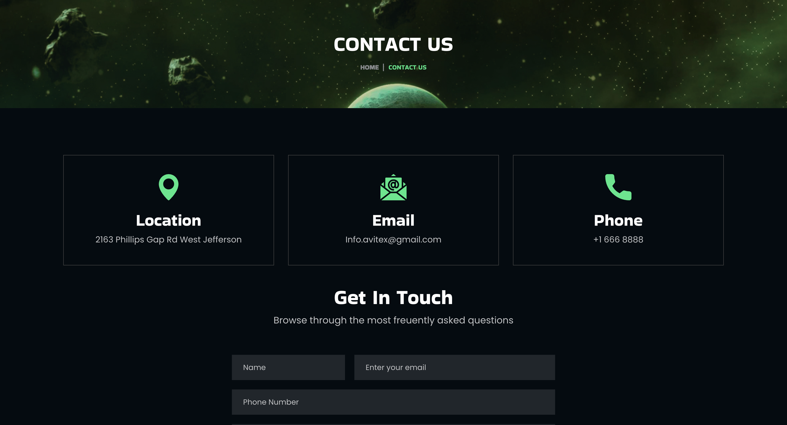
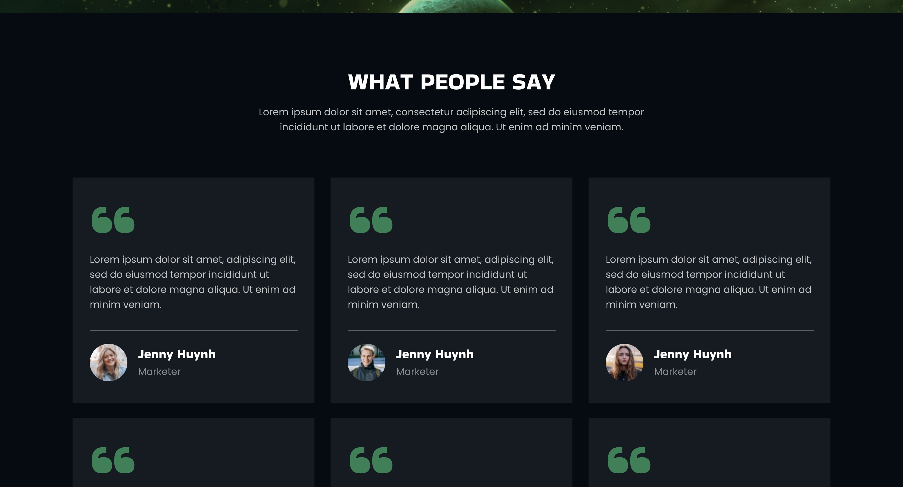

# Семестровая работа 2024 Весна (4 семестр)
\
developer: Станчу Данил Владимирович \
name_project: Binabox \
template_ui_link: [Binabox | NFT Portfolio](https://preview.themeforest.net/item/binabox-nft-portfolio-html-template/full_screen_preview/39941121?_ga=2.96111388.1207829749.1711130062-1867495361.1709358782 "Preview" ) \
link_production: ссылка на развернутое приложение \

#### Структура Readme

- Языки и технологии на которых писался проект \
- Зависимости от сторонних библиотек ваше проекта \
- Файл или команда для наполнения БД тестовыми данными \
- Инструкция по разворачиванию вашего проекта (в докере либо на сервере) \
- Тестовые логины пароли \
- Ссылка на файл .docx с ТЗ по семестровой работе

#### Цитаты великих людей
Ваша работа заполнит большую часть жизни и единственный способ быть
полностью довольным — делать то, что по-вашему является великим делом.
И единственный способ делать великие дела — любить то, что вы делаете.

*— Стив Джобс, Речь в Стенфорде*

## Структура веб-сайта: 

### Выбранные страницы:

- Home 1     

---

- About 1   

---

- Road Map 2  

---

- Sign in 

---

- Sign up 

---

- FAQ 2 

---

- Collection 

---

- Item Detail 

---

- 404 Not Found 

---

- Административная панель (сначала попробую реализовать сам, в крайнем случае возьму готовую)

---

- Покупка подписок

---

- Contact (локация, почта)  

---

- Отзывы (страница с отзывами, пользователи смогут оставлять свои отзывы)  

---

- Blog (страница с новостями, контент добавляет админ, пользователи могут оставлять комментарии)  

---

- Blog Details  

### На всех страницах:

- Шапка с навигацией по сайту:  (Discord убираю, останется 2 кнопки с sign in/up)

- Футер  (Соцсети убираю, остается только связь через email)

### Home 1 

- Из шаблона на странице останется все кроме (Road Map, FAQ и Our Team)

### Road Map 2

- Страница остается без изменений

### Sign in/up

- Страница остается без изменений

- OAuth 2 через Google и какой-нибудь другой сервис (например, ВК, Яндекс)

### FAQ 2

- Страница остается без изменений (возможно анимации при нажатии на вопросы будут изменены)

### Collection

- Страница остается без изменений

- Будет сделана фильтрация

- Пагинация по страницам

- При нажатии на предмет будет открываться страницв `Item Detail`

### Item Detail

- Страница остается без изменений

### 404 Not Found

- Страница остается без изменений

### Покупка подписок 

- На странице будут представлены варианты подписок (условно 3)

- Вся суть подписки заключается в возможности продавать предметы на сайте (обычный пользователь сможет только покупать, для продажинеобходимо оформить подписку)

### Административная панель

- На странице будет: 

    - Дашборд

    - Управление сайтом

    - Управление пользователями

    - Управление магазином

    - Управление отзывами

    - Вкладка с фидбеком от пользователей (при условии, что пользователь нажал кнопку связаться с нами и отправил свое сообщение)

### Отзывы

- Страница с отзывами пользователей и оценкой (от 1 до 5 звезд)

- Авторизованные пользователи смогут оставлть свои отзывы, редактированием которых будет заниматься админ

### Blog 

- Страница с новостным контентом, при нажатии на статью будет открываться новая страница с полной информацией о статье

- Созданием новостей будет заниматься админ

- Пользователи смогут лишь читать сами статьи и отсавлять свои комментарии

- Редактированием комментарием пользователей также будет заниматься админ

## Варианты подписки (роли)

- <b>Не авторизованный пользователь</b> 

    - Может просмотреть только 3 страницы: "Home", "About", "FAQ".

- <b>`Бесплатная` подписка (обычный пользователь)</b> 

    - Может только покупать предметы

- <b>`Premium` подписка (обычный пользователь)</b> 

    - Может покупать предметы

    - Может выставить на продажу свои предметы (не более 5шт за раз)

    - Комиссия за продажу предметов (30%)

- <b>`VIP` подписка</b>

    - Premium

    - Продажа предметов (не более 10 шт за раз)

    - Комиссия за продажу предметов уменьшена до (15%)

- <b>`Admin` (не является вариантом подписки)</b>

    - Имеет доступ к панели администрирования

## Точки расширения приложения

- Добавление аукциона среди подписчиков Premium/VIP

- Добавление возможности обмена предметами среди Premium/VIP

## Архитектура и стек технологий 

<b>Архитектура:</b> Микросервисы

<b>Стек технологий:</b>

1) React JS (фронтенд)

2) ASP.NET Core (бэкенд)   

    - Microsoft Identity (регистрация/авторизация)

    - Прокси-сервер для перенаправления запросов пользователя к необходимому сервису

3) PsotgreSQL (БД для магазина предметов, динамической информации на сайте)

4) MongoDb (БД для авторизации/регистрации пользоваетлей)

5) SignalR

## [Модель БД](https://drawsql.app/teams/1-652/diagrams/binabox)

## [Карта сайта](https://app.flowmapp.com/projects/64089e24-5c5d-4148-ae6f-f029f7f21fff/sitemap/ebc2eacd-730b-4016-add5-6a5eccc3666a)

