#### [Binabox | NFT Portfolio](https://preview.themeforest.net/item/binabox-nft-portfolio-html-template/full_screen_preview/39941121?_ga=2.96111388.1207829749.1711130062-1867495361.1709358782 "Preview" )

## Структура веб-сайта: 

### Выбранные страницы:

- Home 1  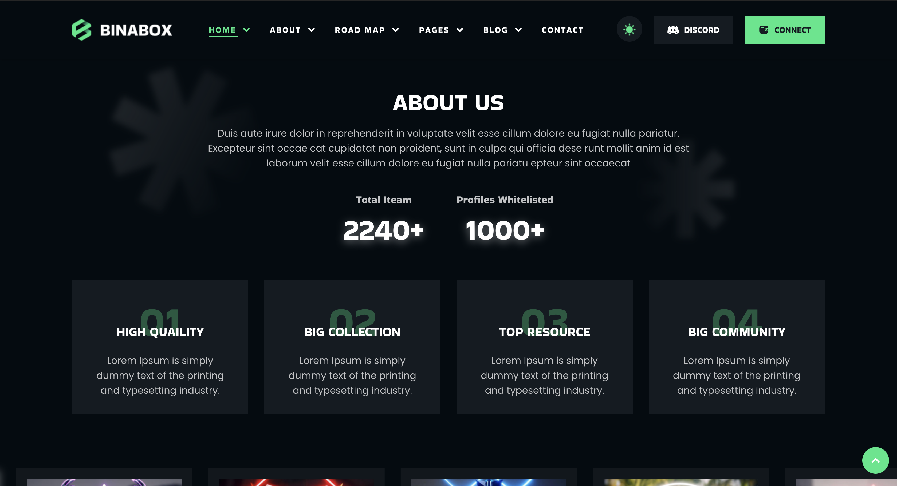 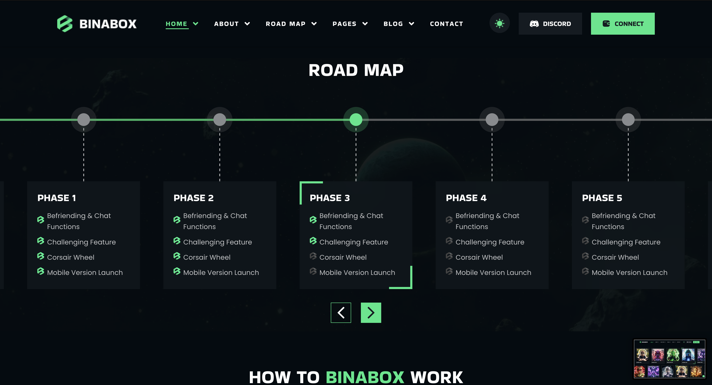  

- About 1 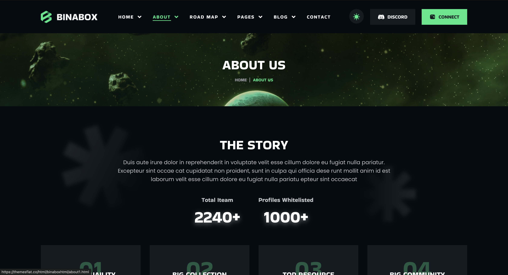 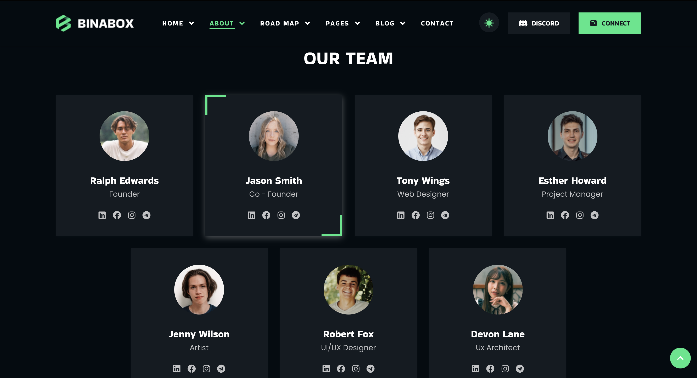 

- Road Map 2 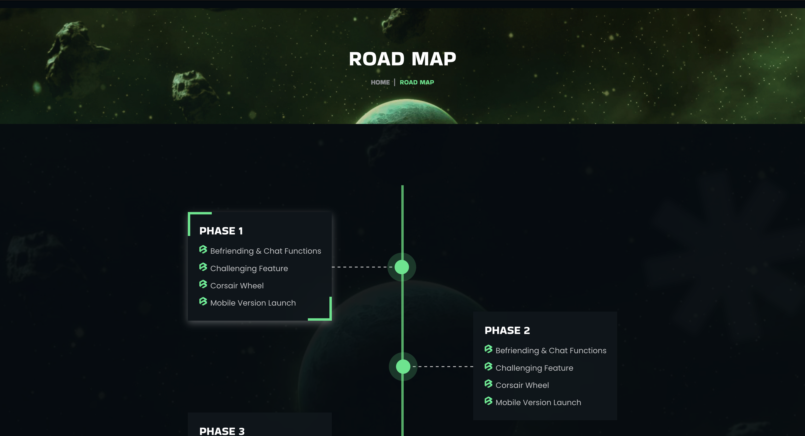 

- Sign in 

- Sign up 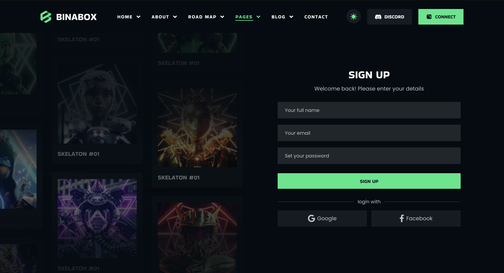

- FAQ 2 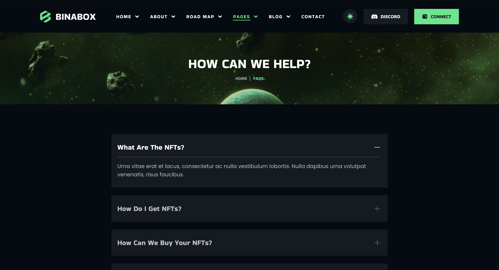

- Collection 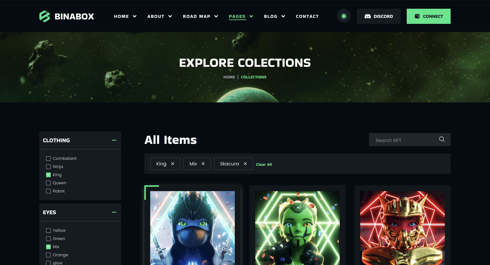

- Item Detail 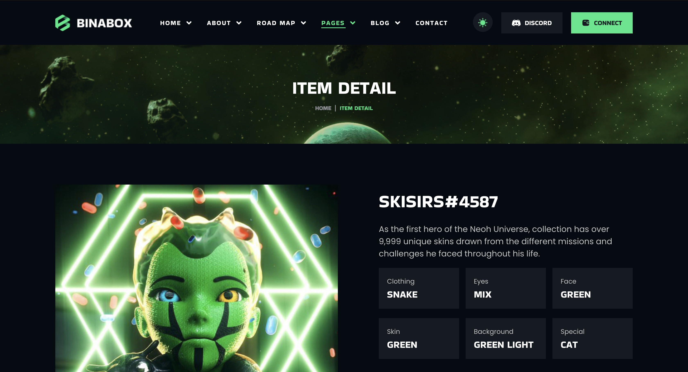

- 404 Not Found 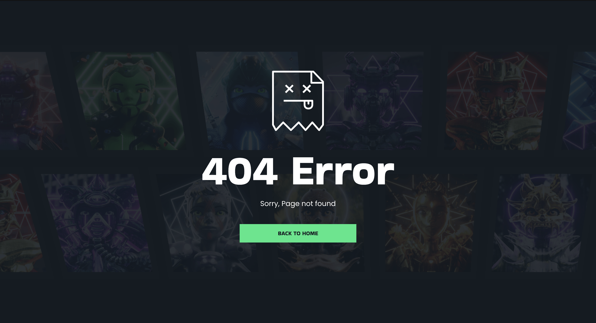

- Административная панель (сначала попробую реализовать сам, в крайнем случае возьму готовую)

- Покупка подписок

- Contact (локация, почта)

- Отзывы (страница с отзывами, пользователи смогут оставлять свои отзывы)

### На всех страницах:

- Шапка с навигацией по сайту:  (Discord убираю, останется 2 кнопки с sign in/up)

- Футер 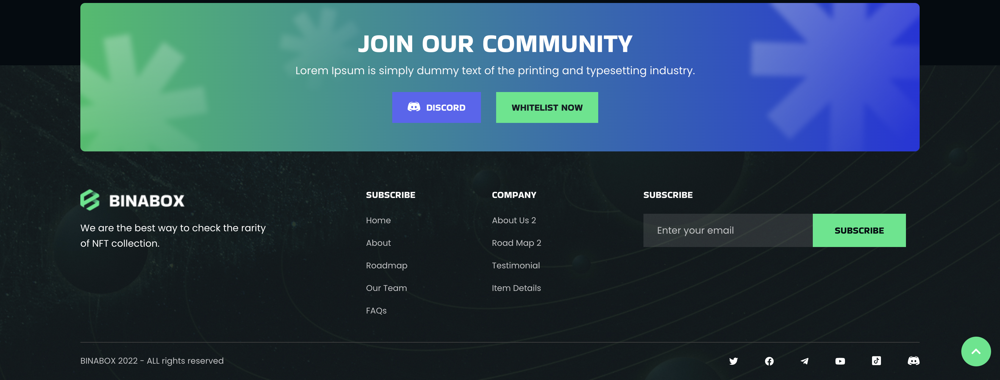 (Соцсети убираю, остается только связь через email)

### Home 1 

- Из шаблона на странице останется все кроме (Road Map, FAQ и Our Team)

### Road Map 2

- Страница остается без изменений

### Sign in/up

- Страница остается без изменений

- OAuth 2 через Google и какой-нибудь другой сервис (например, ВК, Яндекс)

### FAQ 2

- Страница остается без изменений (возможно анимации при нажатии на вопросы будут изменены)

### Collection

- Страница остается без изменений

- Будет сделана фильтрация

- Пагинация по страницам

- При нажатии на предмет будет открываться страницв `Item Detail`

### Item Detail

- Страница остается без изменений

### 404 Not Found

- Страница остается без изменений

### Покупка подписок 

- На странице будут представлены варианты подписок (условно 3)

- Вся суть подписки заключается в возможности продавать предметы на сайте (обычный пользователь сможет только покупать, для продажинеобходимо оформить подписку)

## Варианты подписки (роли)

- <b>Не авторизованный пользователь</b> 

    - Может просмотреть только 3 страницы: "Home", "About", "FAQ".

- <b>`Бесплатная` подписка (обычный пользователь)</b> 

    - Может только покупать предметы

- <b>`Premium` подписка (обычный пользователь)</b> 

    - Может покупать предметы

    - Может выставить на продажу свои предметы (не более 5шт за раз)

    - Комиссия за продажу предметов (30%)

- <b>`VIP` подписка</b>

    - Premium

    - Продажа предметов (не более 10 шт за раз)

    - Комиссия за продажу предметов уменьшена до (15%)

- <b>`Admin` (не является вариантом подписки)</b>

    - Имеет доступ к панели администрирования

## Точки расширения приложения

- Добавление аукциона среди подписчиков Premium/VIP

- Добавление возможности обмена предметами среди Premium/VIP

## Архитектура и стек технологий 

<b>Архитектура:</b> Микросервисы

<b>Стек технологий:</b>

1) React JS (фронтенд)

2) ASP.NET Core (бэкенд)   

    - Microsoft Identity (регистрация/авторизация)

    - Прокси-сервер для перенаправления запросов пользователя к необходимому сервису

3) PsotgreSQL (БД для магазина предметов, динамической информации на сайте)

4) MongoDb (БД для авторизации/регистрации пользоваетлей)

5) SignalR

## [Модель БД](https://drawsql.app/teams/1-652/diagrams/binabox)

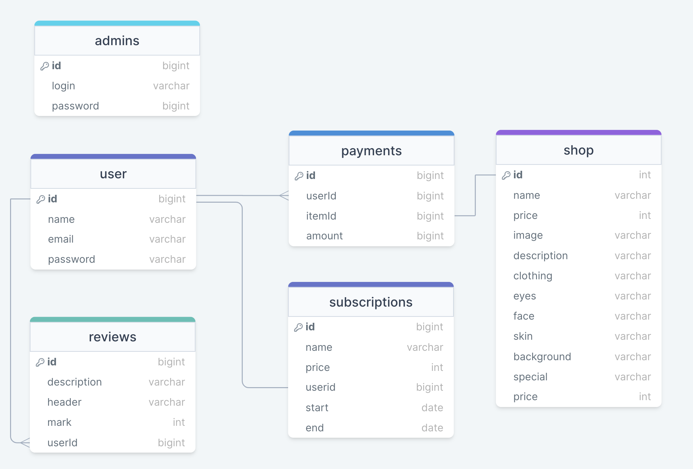

## Карта сайта

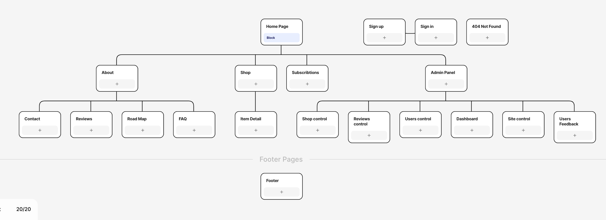